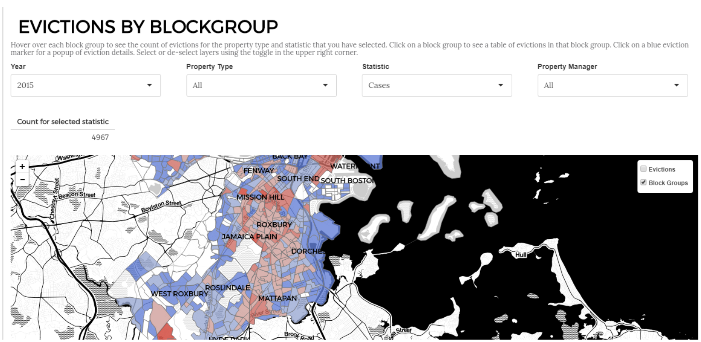
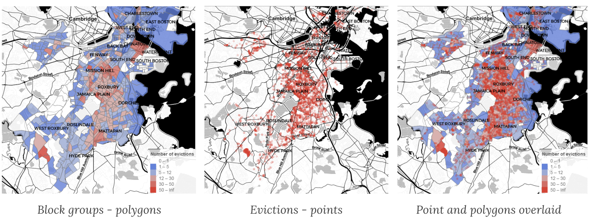
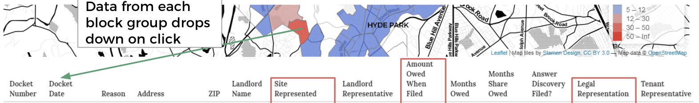

## Purpose and Background
The purpose of this project was to help the Office of Housing Stability gain insight from their eviction data. The main objectives were to help the office understand geographic variation in evictions, the property managers who were evicting the most tenants, and to evaluate the City’s progress on reducing evictions. 

## Data
The data underlying this application was intially collected by volunteers who transcribed physical records from Boston's Housing Court into an excel spreadsheet. The data was cleaned and reshaped for visualization in the app. The app includes data on evictions from 2014-2016.

## App and Screenshots

[Open app](http://analytics.boston.gov:3838/app/eviction-analysis) (Credentials required)

The app is secured to protect individual-level data. The screenshots below show the appearance and capabilities of the application.

### Filters and appearance

### Levels of Geographic Visualization

### Street-Level Insight

### Export the underlying data

## Built with
- [R Shiny](https://shiny.rstudio.com/)
- [Leaflet](https://rstudio.github.io/leaflet/)
