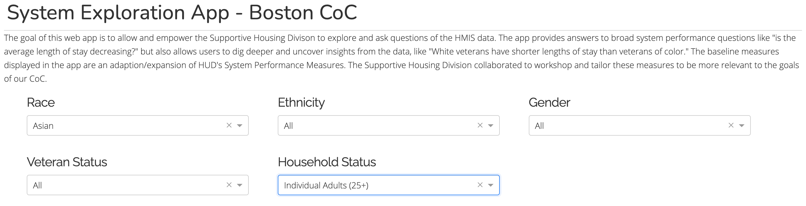

[Open app](https://system-performance-app.herokuapp.com/) (Credentials required)

## Purpose / Audience

This repo houses a web application that displays core metrics about the Boston Homelessness Continuum of Care that can be filtered across a variety of demographics and subpopulations.

The goal of this web app is to allow and empower the Supportive Housing Divison to explore and ask questions of the HMIS data. The app provides answers to broad system performance questions like "is the average length of stay decreasing?" but also allows users to dig deeper and uncover insights from the data, like "White veterans are older and have shorter lengths of stay than veterans of color" (no clue if that's true - just an example). The baseline measures displayed in the app are an adaption/expansion of HUD's [System Performance Measures](https://www.hudexchange.info/programs/coc/system-performance-measures/#guidance). The Supportive Housing Division collaborated to workshop and tailor these measures to be more relevant to the goals of our CoC.

## Data

The data used to power this app was pulled from the City of Boston's HMIS. R scripts cleaned, reshaped, and deidentified HMIS data into key reporting tables, which were then written to a Postgres backend.

The app operates off the following key reporting tables:

*Census*  
Number of individuals in Emergency Shelter / Street Outreach on a given night, by Gender, Race, Ethnicity, Household Status, and Veteran Status

*Inflow*  
Number of individuals experiencing their first-ever stay in an Emergency Shelter / Street Outreach in a given year, by Gender, Race, Ethnicity, Household Status, and Veteran Status

*Exits to Permanent Housing*  
Number of individuals exiting to a permanent housing destination in a given year, by Gender, Race, Ethnicity, Household Status, and Veteran Status

*Returns to Shelter*  
Number of individuals returning to Emergency Shelter or Street Outreach from a prior exit to a permanent housing destination in a given year, by Gender, Race, Ethnicity, Household Status, and Veteran Status

The tables above all have the following structure, with 'count' corresponding to the appropriate metric in each table:

| year | race | ethnicity | gender | veteranstatus | householdtype | count |
|------|------|-----------|--------|---------------|---------------|-------|
|      |      |           |        |               |               |       |

*Length of Stay*  
Average length of stay in Emergency Shelter / Street Outreach in a given year, by Gender, Race, Ethnicity, Household Status, and Veteran Status. This table has a slightly different structure so that we can take a weighted average length of stay depending which demographic filters are selected:

| year | race | ethnicity | gender | veteranstatus | householdtype | numclients | avglos |
|------|------|-----------|--------|---------------|---------------|------------|--------|
|      |      |           |        |               |               |            |        |

## Screenshots

The app is secured to protect government information. Screenshots of the app with fictitious data can be found below to see a sample of the app's appearance:

## Built With

- [Python Flask](http://flask.pocoo.org/)
- [Plotly Dash](https://dash.plot.ly/)
- Hosted on Heroku
