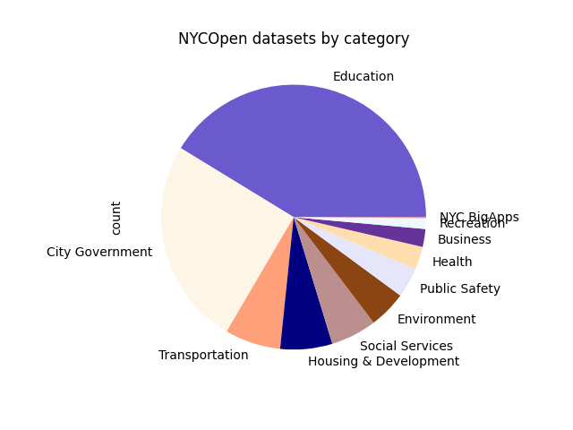
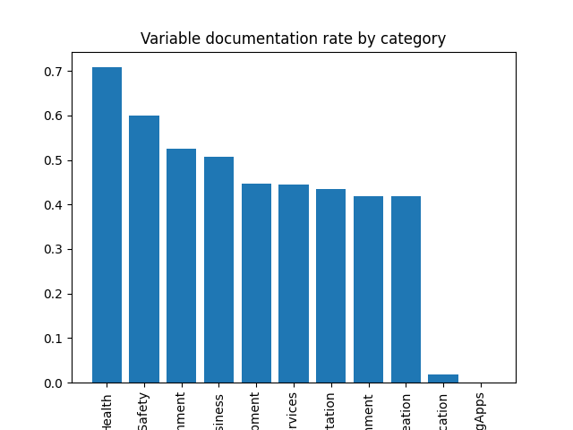
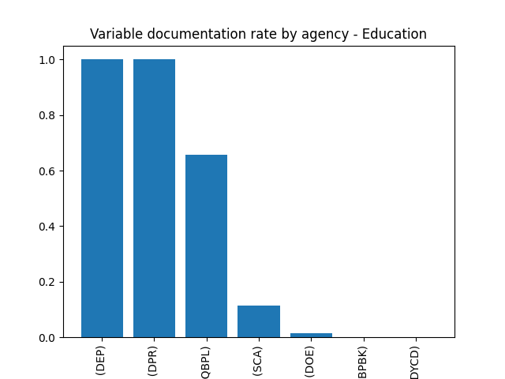
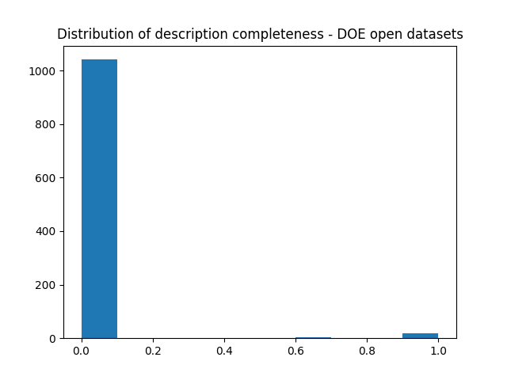
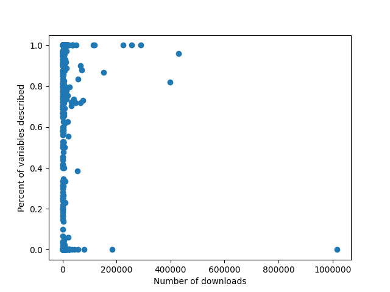

## Purpose and Background
This project is an evaluation of the metadata of NYC Open Datasets. Government data portals are intended to expand public access to information by giving constituents access to data, but is the data that is published contextualized well enough to enable non-expert use?

## Data
The data used for this evaluation was sourced by querying the [Socrata Discovery API](https://socratadiscovery.docs.apiary.io)

## Results

Most of the datasets on NYCOpenData fall into the education category

The datasets in the education category are also the least well-described - on average, datasets in the edcuation category have only 1% of their variables described in the human-readable metadata. This means it might be difficult for users of the data portal to contextualize these datasets, or understand how they were collected and how they should and shouldn't be interpreted. 

Most of the datasets in the Education category come from the Department of Education, the agency that also drives the low documentation rate of these datasets.

Most of the DOE's datasets have none of their variables described in the portal.

Finally, there is no correlation between how well-documented a dataset is and the number of times it gets downloaded. It seems that users don't necessarily prefer to work with datasets that are well described, even though variable descriptions provide important context for working with data. 

