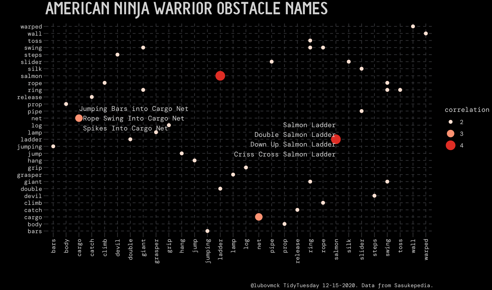
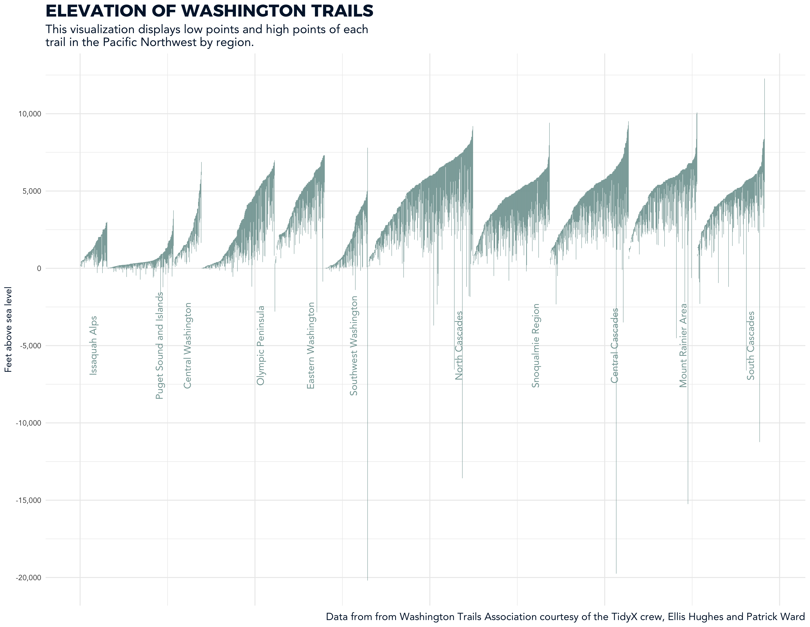

An archive of my #TidyTuesday visualizations and code. #TidyTuesday is a weekly data challenge founded in 2018 by Thomas Mock and organized by the R4DS ("R for Data Science") online learning community. Each week, a new dataset is provided at [TidyTuesday](https://github.com/rfordatascience/tidytuesday) for members of the community to practice cleaning, reshaping, and visualizing via the tidyverse collection of R packages.

## 12.15.2020: American Ninja Warrior [(code)](https://github.com/lmckone/TidyTuesday/blob/master/R/ninja.R)

## 11.24.2020: Washington Hiking Trails [(code)](https://github.com/lmckone/TidyTuesday/blob/master/R/hike.R)

